# Automation Examples with Mermaid Diagrams

This document shows real-world examples of how the auto-activation system works with visual Mermaid diagrams.

---

## Table of Contents

1. [Use Case 1: Creating a New API Endpoint](#use-case-1-creating-a-new-api-endpoint)
2. [Use Case 2: Building a React Component](#use-case-2-building-a-react-component)
3. [Use Case 3: Debugging an Error](#use-case-3-debugging-an-error)
4. [Use Case 4: Refactoring Code](#use-case-4-refactoring-code)
5. [System Architecture](#system-architecture)
6. [Auto-Activation Flow](#auto-activation-flow)

---

## Use Case 1: Creating a New API Endpoint

### Scenario
Developer wants to add a new authenticated endpoint for user registration.

### Flow Diagram

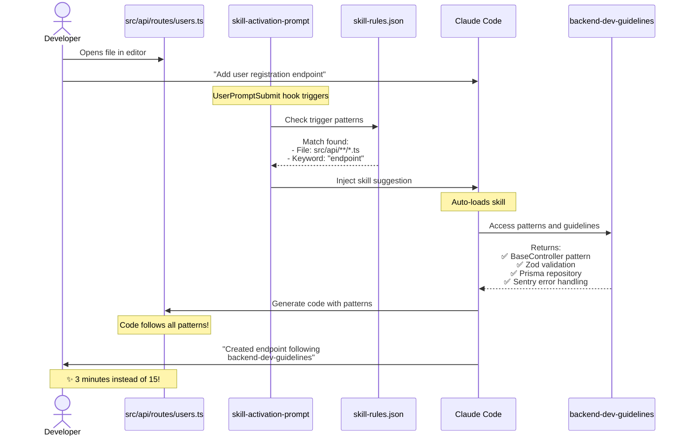

### Without Automation

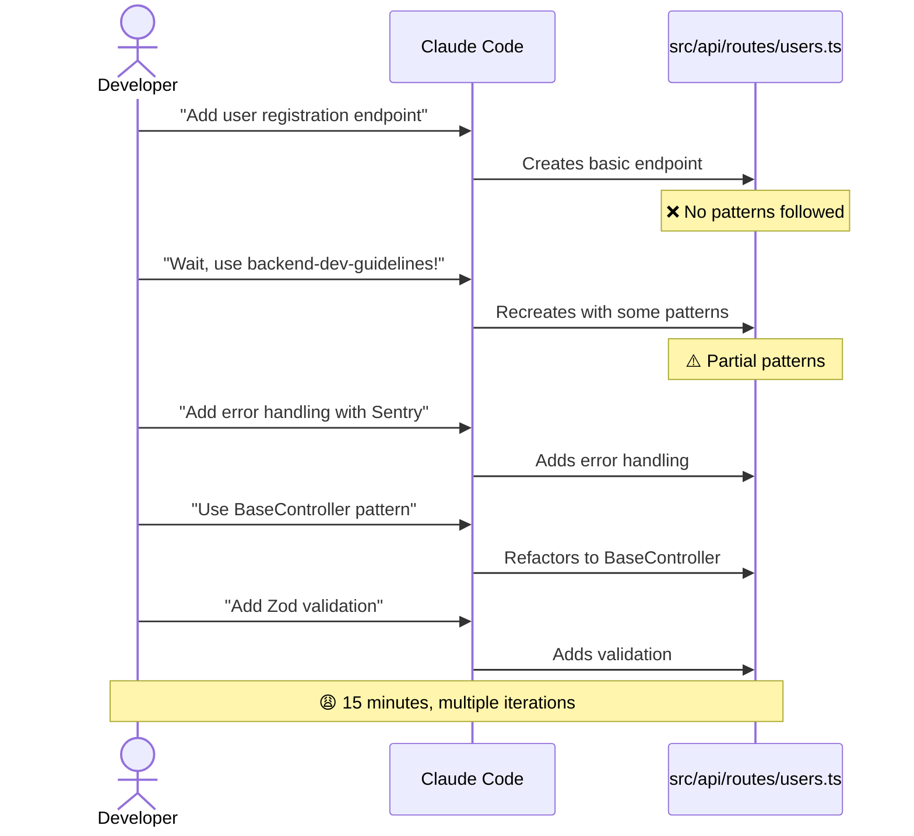

### Time Comparison

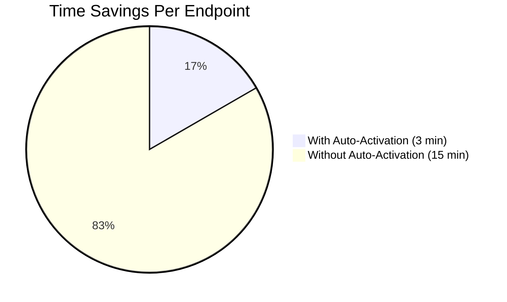

---

## Use Case 2: Building a React Component

### Scenario
Developer creates a data grid component with MUI v7.

### Flow Diagram

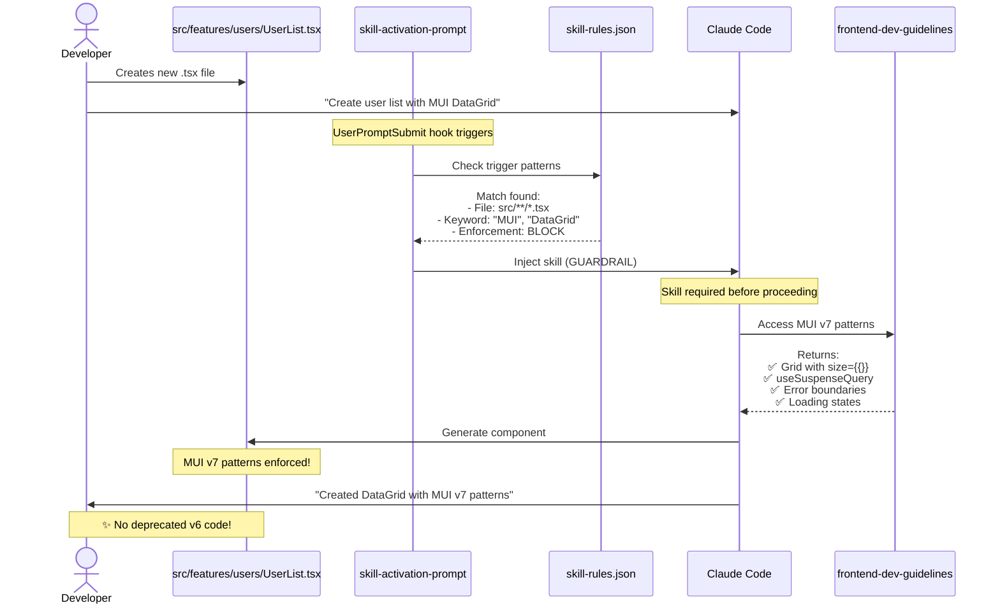

### Guardrail Protection

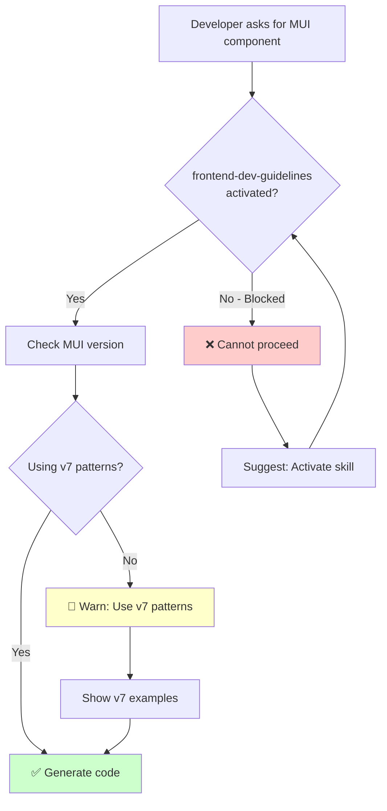

---

## Use Case 3: Debugging an Error

### Scenario
Frontend build fails with TypeScript errors.

### Flow Diagram

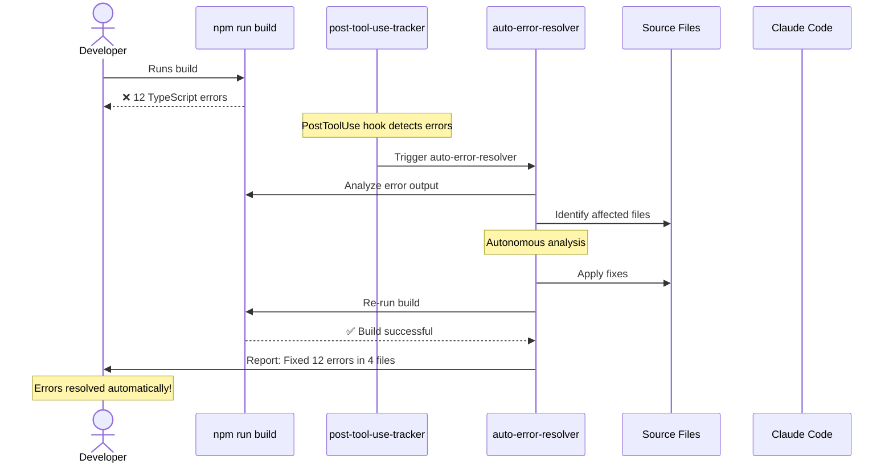

### Error Resolution Flow

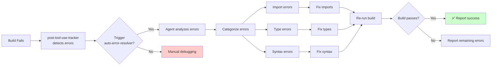

---

## Use Case 4: Refactoring Code

### Scenario
Developer needs to move authentication logic to a shared package.

### Flow Diagram

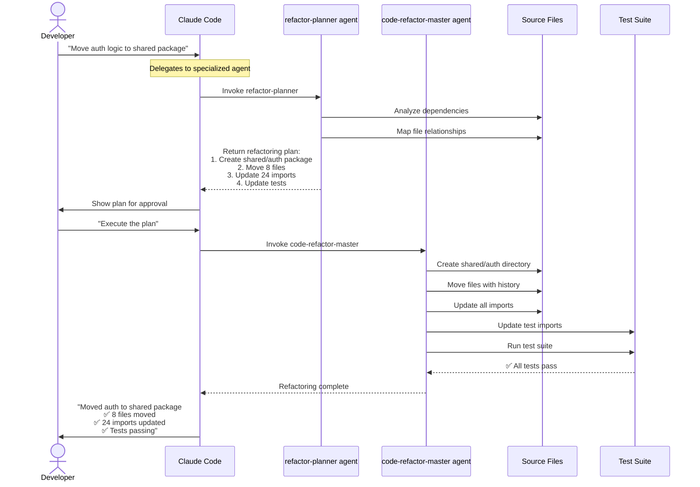

### Agent Collaboration

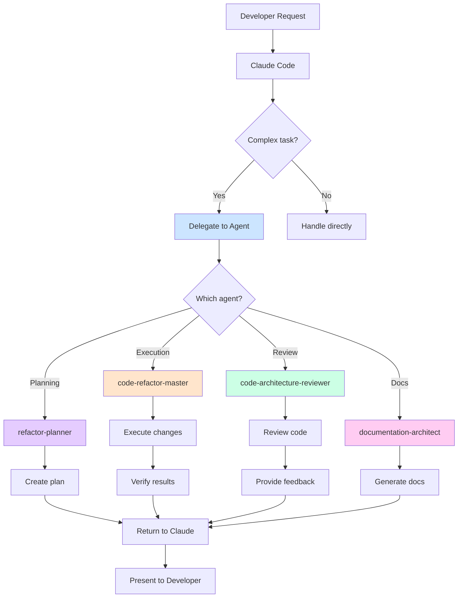

---

## System Architecture

### Complete Auto-Activation System

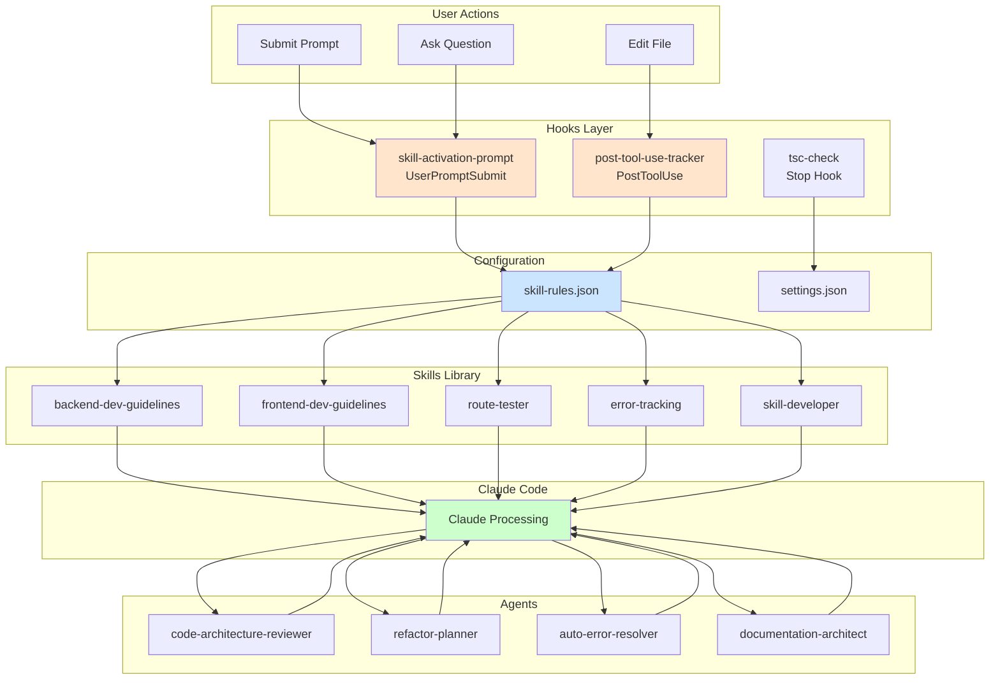

---

## Auto-Activation Flow

### Detailed Trigger Mechanism

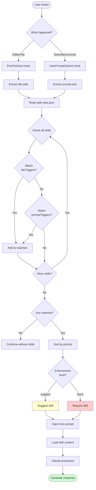

### Skill Matching Logic

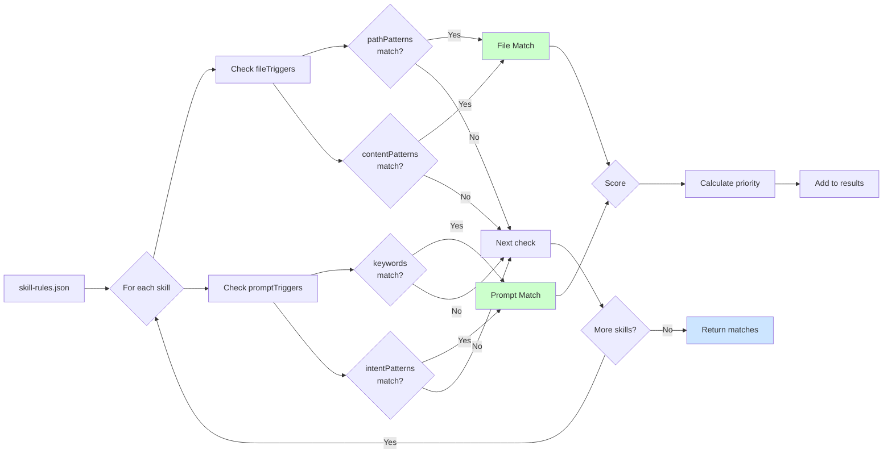

---

## Time Savings Visualization

### Daily Developer Workflow

```mermaid
gantt
    title Developer Time Comparison (Typical Day)
    dateFormat X
    axisFormat %M min
    
    section Without Auto-Activation
    Create 3 API endpoints    :a1, 0, 45
    Build 2 React components  :a2, after a1, 60
    Debug errors manually     :a3, after a2, 40
    Context rebuilds (3x)     :a4, after a3, 30
    Manual skill invocations  :a5, after a4, 20
    
    section With Auto-Activation
    Create 3 API endpoints    :b1, 0, 9
    Build 2 React components  :b2, after b1, 20
    Auto-resolved errors      :b3, after b2, 5
    Context preserved         :b4, after b3, 0
    Automatic skill loading   :b5, after b4, 0
```

### Productivity Metrics

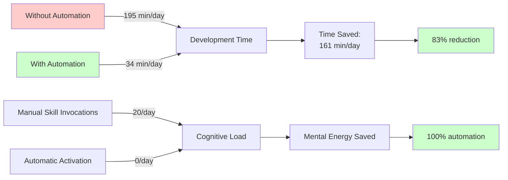

---

## Real-World Impact

### Cumulative Time Savings

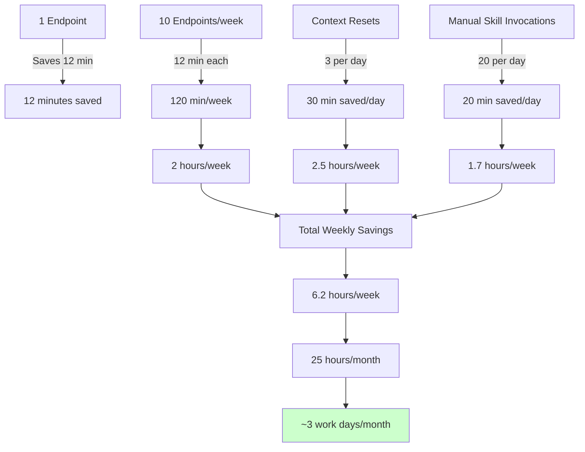

---

## Implementation in Another Repo

To implement this automation system in a repository without automations:

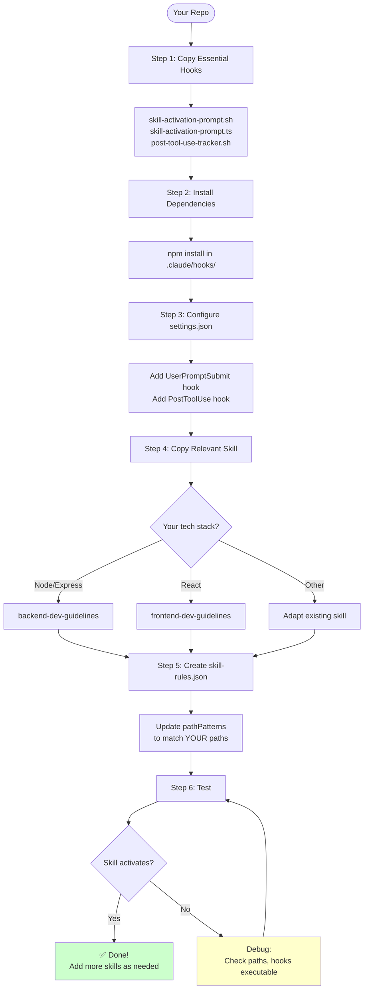

### Quick Setup Commands

```bash
# 1. Create structure
mkdir -p .claude/hooks
mkdir -p .claude/skills
mkdir -p .claude/agents

# 2. Copy hooks from this repo
cp path/to/showcase/.claude/hooks/skill-activation-prompt.* .claude/hooks/
cp path/to/showcase/.claude/hooks/post-tool-use-tracker.sh .claude/hooks/

# 3. Make executable
chmod +x .claude/hooks/*.sh

# 4. Install dependencies
cd .claude/hooks && npm install

# 5. Copy a skill
cp -r path/to/showcase/.claude/skills/backend-dev-guidelines .claude/skills/

# 6. Copy and customize skill-rules.json
cp path/to/showcase/.claude/skills/skill-rules.json .claude/skills/
# Edit pathPatterns to match YOUR project structure

# 7. Add to settings.json (see COMPREHENSIVE_GUIDE.md for full config)
```

---

## Summary

These diagrams show how the auto-activation system:

1. **Detects context** (files, prompts) automatically
2. **Matches skills** based on rules
3. **Injects guidance** proactively
4. **Saves time** (80%+ reduction)
5. **Ensures consistency** (enforced patterns)

The system transforms Claude Code from a helpful assistant into an expert team member who knows your patterns and applies them automatically.
